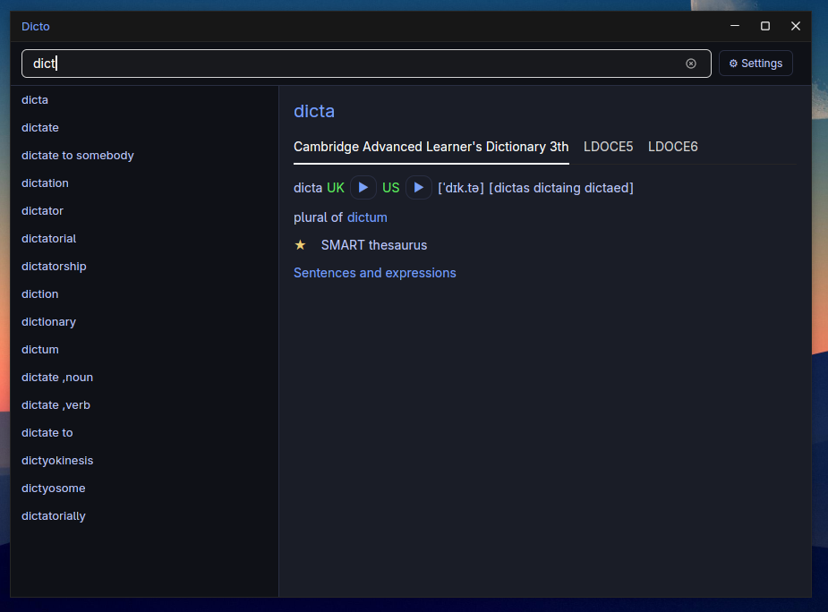

<p align="center"></p>

<h1 align="center">Dicto</h1>

<p align="center">A fast, offline desktop dictionary for Linux built in Rust. Reads MDX/MDD dictionary files — the same format used by GoldenDict, MDict, and most popular dictionary packs.</p>



## Features

- **Minimal, native UI** — built on GPUI (the engine behind Zed), renders at 120 fps with no Electron overhead
- **Instant search** — suggestions appear as you type, results load in milliseconds
- **Faithful rendering** — full HTML output with per-dictionary CSS so each dict looks exactly as its author intended
- **Multi-dictionary** — load as many MDX files as you like, enable/disable/reorder them without restarting

## Installation

### Arch Linux (AUR-style)

```bash
cd packaging/arch
makepkg -si
```

### From source

```bash
cargo build --release --package dicto
# binary at target/release/dicto
```

**Runtime dependencies:** `gtk3`, `alsa-lib`, `libxkbcommon`, `lzo`

## Dictionary setup

Drop your `.mdx` (and optional `.mdd`) files into:

```text
~/.config/dicto/dicts/
```

Dicto auto-discovers them on next launch. No config editing needed.  
Enable, disable, and reorder dictionaries from the settings dialog (⚙ button).

## Supported formats

| Format | Status |
| ------ | ------ |
| MDX v2 (UTF-8, UTF-16) | ✓ Full support |
| MDX v1 | ✓ Full support |
| MDD resource containers | ✓ Images, audio, CSS |
| Encryption level 0, 2 | ✓ Supported |

## Architecture

The workspace has two crates:

- **`mdict-rs`** (library) — MDX/MDD parser, redb indexer, query pipeline, settings
- **`dicto`** (binary) — GPUI desktop app

## References

- [mdict-analysis](https://bitbucket.org/xwang/mdict-analysis) — MDX/MDD format specification
